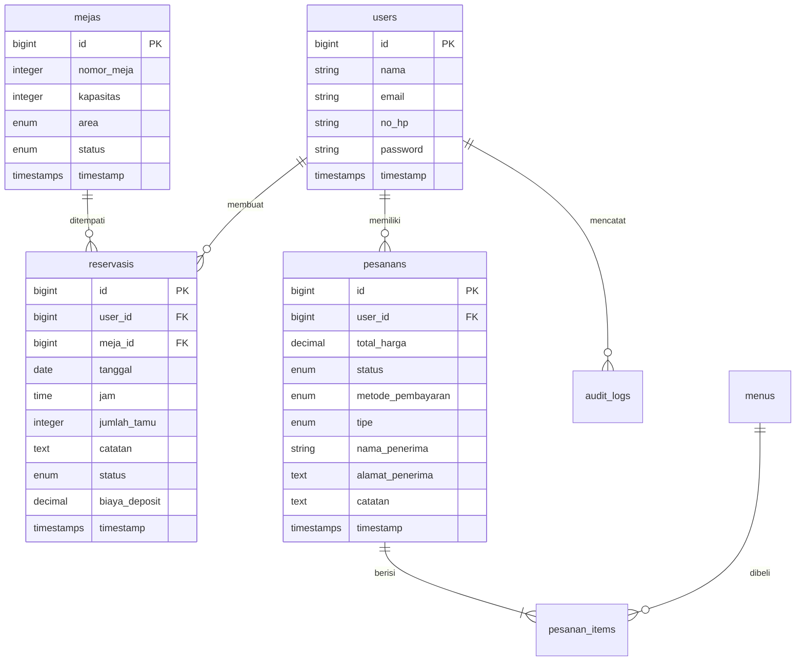

# 🍽️ Lumière Dining — Premium Restaurant Management System

[](https://laravel.com)
[](https://tailwindcss.com)
[](https://alpinejs.dev)
[](LICENSE)

**Lumière Dining** adalah sistem manajemen pemesanan meja (*table reservation*) dan pemesanan menu hidangan premium (*food ordering*) berbasis web. Aplikasi ini dirancang khusus untuk memberikan pengalaman pengguna kelas atas (*fine dining experience*) dengan antarmuka yang mewah, premium, dan interaktif.

Sistem dibangun menggunakan **Laravel 11**, **Tailwind CSS**, dan **Alpine.js** dengan menerapkan standar arsitektur bersih, keamanan tinggi, dan performa database yang teroptimasi.

---

## 🌟 Fitur Unggulan & Optimasi Sistem

Aplikasi ini telah dioptimalkan secara mendalam untuk menangani beban tinggi (*high traffic*) dan menjaga integritas data:

### 1. Sistem Autentikasi Ganda & Log Audit
* **Login Fleksibel**: Pengguna dapat masuk menggunakan **Email** atau **Nomor Handphone (`no_hp`)**.
* **Registrasi Stepper Form**: Antarmuka pendaftaran bertahap (*multi-step wizard*) yang didukung reaktivitas instan.
* **Audit Trail Keamanan**: Setiap aktivitas sensitif (pendaftaran, login, logout, reservasi, pemesanan) dicatat ke dalam tabel `audit_logs` untuk pelacakan keamanan.

### 2. Reservasi Meja Dinamis & Cek Bentrok Waktu (UX Premium)
* **Pencegahan Bentrok Jadwal**: Berbeda dengan sistem statis, ketersediaan meja diperiksa secara dinamis berdasarkan data pemesanan di database pada **tanggal** dan **jam** yang dipilih. 
* **Auto-Clear Selection (UX Cerdik)**: Jika pengguna mengubah tanggal/jam dan meja yang sedang dipilih ternyata bentrok, pilihan meja akan otomatis di-reset secara reaktif menggunakan Alpine.js.
* **Validasi Kapasitas**: Sistem memverifikasi bahwa jumlah tamu tidak melebihi kapasitas maksimal meja.

### 3. Pemesanan Makanan Premium & Proteksi Stok (Pessimistic Locking)
* **Keranjang Belanja Real-Time**: Interaksi tambah, kurang, dan hapus item menu hidangan secara instan tanpa membebani server (meminimalkan *refresh* halaman).
* **Proteksi Double-Checkout**: Menggunakan **Pessimistic Locking (`lockForUpdate()`)** pada database menu untuk menghindari *race conditions* saat beberapa pelanggan membeli menu dengan sisa stok terakhir secara bersamaan.
* **Metode Pembayaran**: Terintegrasi pilihan pembayaran modern seperti **QRIS**, **Transfer Bank**, atau **Tunai**.

### 4. Dasbor Interaktif & Timeline Riwayat $O(1)$
* **Statistik Dinamis**: Kartu metrik pesanan aktif, total reservasi, dan hitung mundur (*countdown*) otomatis reservasi terdekat Anda.
* **Paginasi Database Efisien**: Halaman riwayat menggabungkan data reservasi dan pesanan menggunakan SQL `UNION` di tingkat database. Sistem hanya mengambil tepat 5 data per halaman (`LIMIT 5 OFFSET X`) dan baru melakukan *eager-loading* untuk 5 baris tersebut. Ini mencegah pemborosan memori RAM server.

### 5. Antrean Email Sambutan Asinkron (Queued Mail)
* **Background Queue**: Mengirimkan HTML Welcome Email mewah pasca-registrasi menggunakan **Laravel Queue System** (`implements ShouldQueue`). Halaman registrasi merespon seketika, meningkatkan kepuasan pengguna.

---

## 💻 Arsitektur & Teknologi

* **Framework Backend**: Laravel 11.x
* **Bahasa**: PHP 8.2+
* **Database**: MySQL (Produksi) / SQLite (Pengujian terotomatisasi)
* **Aset Bundler**: Vite 5.x
* **Frontend**: Tailwind CSS v3 & Alpine.js v3
* **Testing Suite**: PHPUnit (TDD Ready)

---

## 🗄️ Skema Database Utama

Berikut adalah visualisasi entitas relasional utama yang menyokong sistem Lumière Dining:



---

## 🚀 Panduan Instalasi Lokal

Ikuti langkah-langkah di bawah ini untuk menjalankan aplikasi di komputer lokal menggunakan **Laragon**, **XAMPP**, atau **PHP CLI**:

### 1. Persiapan Repositori & Dependensi
```bash
# Clone proyek ini
git clone https://github.com/username/uas_pemrograman.git
cd uas_pemrograman

# Instal dependensi PHP
composer install

# Instal dependensi JavaScript/CSS
npm install
```

### 2. Konfigurasi Lingkungan (`.env`)
Salin berkas konfigurasi `.env.example` ke file baru bernama `.env`:
```bash
cp .env.example .env
```
Sesuaikan konfigurasi koneksi database MySQL lokal di file `.env`:
```ini
DB_CONNECTION=mysql
DB_HOST=127.0.0.1
DB_PORT=3306
DB_DATABASE=lumiere_dining
DB_USERNAME=root
DB_PASSWORD=
```

### 3. Migrasi Database & Seeder
Buat database baru bernama `lumiere_dining` di MySQL server lokal Anda, lalu jalankan:
```bash
# Generate key enkripsi aplikasi
php artisan key:generate

# Jalankan migrasi dan isi data awal (katalog meja, menu, dan riwayat demo)
php artisan migrate:fresh --seed

# Hubungkan symlink storage untuk memuat gambar hidangan
php artisan storage:link
```

### 4. Jalankan Aplikasi
Jalankan server lokal Laravel dan bundler aset Vite secara paralel:
```bash
# Jalankan di Terminal 1
php artisan serve

# Jalankan di Terminal 2
npm run dev
```
Aplikasi kini siap diakses di peramban Anda melalui alamat **`http://localhost:8000`**.

---

## ⚙️ Panduan Deploy ke Server Produksi

Saat melakukan deploy ke VPS (Ubuntu/Debian) atau Shared Hosting, ikuti langkah-langkah optimasi keamanan dan performa berikut:

### 1. Pengamanan File `.env` (Mutlak)
Pastikan mode debug dinonaktifkan untuk menghindari kebocoran data sensitif:
```ini
APP_ENV=production
APP_DEBUG=false
APP_URL=https://domain-anda.com

# Wajib untuk HTTPS (SSL)
SESSION_SECURE_COOKIE=true
```

### 2. Optimasi Autoloader & Caching Laravel
Jalankan perintah ini di direktori root server produksi untuk mematikan pembacaan file dinamis yang lambat dan mempercepat respon aplikasi hingga 30%:
```bash
# Optimasi Autoloader Composer
composer install --no-dev --optimize-autoloader

# Caching Konfigurasi, Route, dan View
php artisan config:cache
php artisan route:cache
php artisan view:cache
```

### 3. Kompilasi Aset Frontend Produksi
```bash
npm install
npm run build
```

### 4. Menjalankan Antrean Email (Queue Worker)
Karena email dikirim secara asinkron lewat queue, Anda harus menjalankan worker di server produksi. Konfigurasikan driver antrean di `.env`:
```ini
QUEUE_CONNECTION=database
```
Jalankan worker menggunakan perintah ini:
```bash
php artisan queue:work
```
*Disarankan menggunakan monitoring tool seperti **Supervisor** di Ubuntu/VPS agar queue worker selalu menyala secara otomatis.*

---

## 🧪 Pengujian Aplikasi (Automated Testing)

Aplikasi memiliki integrasi pengujian terotomatisasi (*automated unit and integration testing*). Anda dapat menjalankannya kapan saja untuk memverifikasi fungsionalitas registrasi, login fleksibel, validasi data, pengiriman email terantre, dan proteksi rute.

Jalankan perintah pengujian berikut:
```bash
php artisan test
```

---

## 👤 Akun Demo Uji Coba

Gunakan akun ber-seeder default berikut untuk menjelajahi dasbor tanpa perlu registrasi ulang:
* **Email / No. HP**: `guest@lumiere.com` atau `081234567890`
* **Password**: `password`
```
